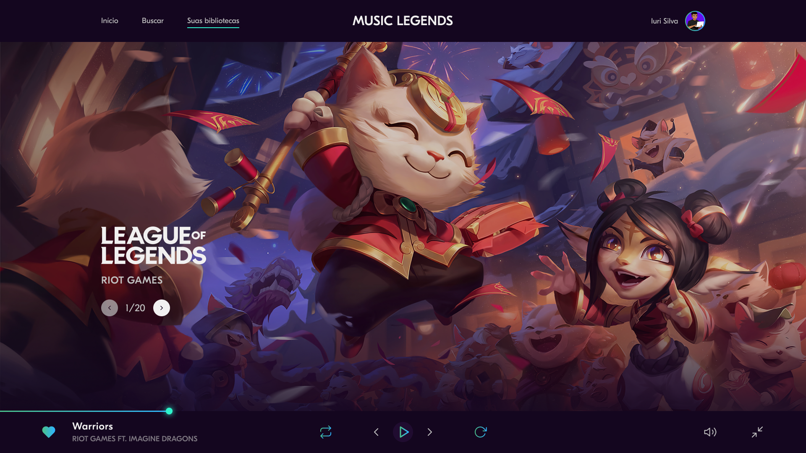

<h1 align="center">Music Legends | Desafio Codelândia</h1>

    

  <a href="#-tecnologias">Tecnologias</a>&nbsp;&nbsp;&nbsp;|&nbsp;&nbsp;&nbsp;
  <a href="#-projeto">Projeto</a>&nbsp;&nbsp;&nbsp;|&nbsp;&nbsp;&nbsp;
  <a href="#memo-licença">Licença</a>

 
  
  

  

 

  

## Tecnologias

Esse projeto foi desenvolvido com as seguintes tecnologias:

### HTML5

### CSS3

### JavaScript

### SVG Inject

## 🚧 Projeto:

[Confira aqui!](https://musiclegends.vercel.app/).

## 🎨 Inspiração:

Figma: [Desafio Codelândia](https://www.figma.com/file/Yb9IBH56g7T1hdIyZ3BMNO/Desafios---Codel%C3%A2ndia?node-id=80254%3A764/).

Protótipo desenvolvido por [Iuri Silva](https://www.instagram.com/iuricode/).

## 📝 Licença

Esse projeto está sob a licença MIT. Veja o arquivo LICENSE para mais detalhes.

Made by Jhonatan Oliveira.
